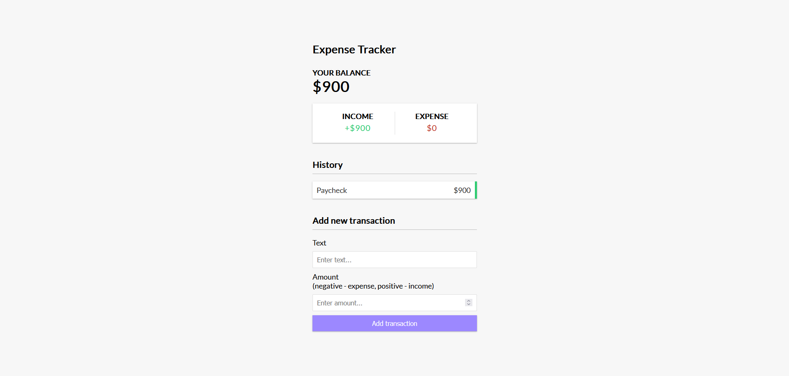

# vue-expense-tracker

This is a simple expense tracker made using the Vue 3 Composition API. 
It does not use a backend, instead it uses Local Storage to save the data.

## Project Setup

```sh
npm install
```

### Compile and Hot-Reload for Development

```sh
npm run dev
```

### Project Image
